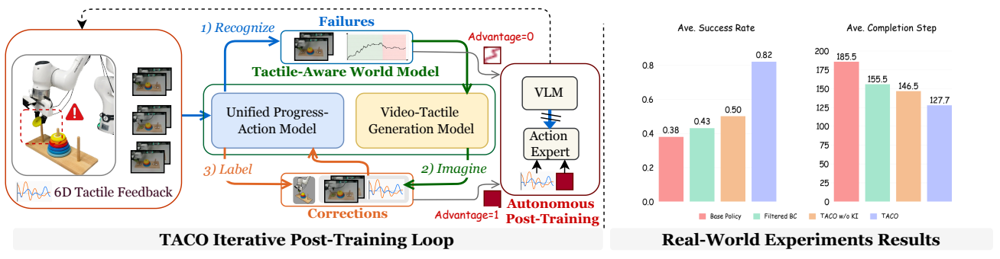
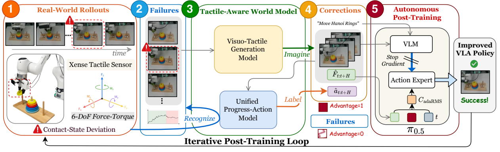
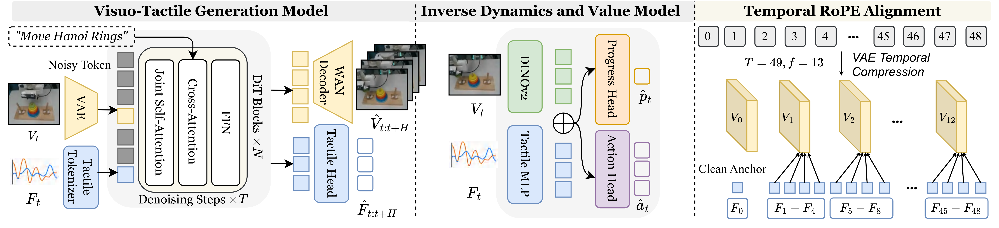

<div align="center">

# TACO: TActile World Model as a Self-COrrector for Scalable VLA Post-Training

[](https://arxiv.org/pdf/2607.02840)
[](https://taco-wm.github.io/)
[](#-roadmap)
[](./LICENSE)

<p>
  <a href="https://liushb9.github.io/">Shengbang Liu</a><sup>1,3,*</sup>&nbsp;&nbsp;
  <a href="https://jiayueru.github.io/">Yueru Jia</a><sup>1,2,*</sup>&nbsp;&nbsp;
  <a href="https://github.com/avx34/">Yuyang Yan</a><sup>1,*</sup>&nbsp;&nbsp;
  <a href="https://liujiaming1996.github.io/">Jiaming Liu</a><sup>1,*,†</sup>&nbsp;&nbsp;
  <a href="https://github.com/XinranJoy">Xinran Zhang</a><sup>1,2,*</sup>&nbsp;&nbsp;
  <a href="https://github.com/xuanxuanzzzii">Qiuxuan Feng</a><sup>1</sup>&nbsp;&nbsp;
  <a href="https://scholar.google.com/citations?user=fWDoWsQAAAAJ&hl=en">Yandong Guo</a><sup>2</sup>&nbsp;&nbsp;
  <a href="https://arnoldshijizhou.github.io/">Shiji Zhou</a><sup>4</sup>&nbsp;&nbsp;
  <a href="https://camera.pku.edu.cn/">Boxin Shi</a><sup>1</sup>&nbsp;&nbsp;
  <a href="https://scholar.google.com/citations?user=voqw10cAAAAJ&hl=en">Shanghang Zhang</a><sup>1,📧</sup>
</p>

<p>
  <sup>1</sup>State Key Laboratory of Multimedia Information Processing, School of Computer Science, Peking University<br>
  <sup>2</sup>AI2 Robotics&nbsp;&nbsp;
  <sup>3</sup>Sun Yat-sen University&nbsp;&nbsp;
  <sup>4</sup>Beihang University
</p>

<sub><sup>*</sup>Equal Contribution&nbsp;&nbsp;<sup>†</sup>Project Lead&nbsp;&nbsp;<sup>📧</sup>Corresponding Author</sub>

</div>

---

<p align="center">
  
</p>

TACO is a tactile-aware world-model-driven framework for scalable VLA post-training in contact-rich robot manipulation. Given real-world rollouts, TACO follows a **Recognize-Imagine-Label** loop: it recognizes failure-adjacent contact states, imagines local visuo-tactile correction segments, and labels corrective actions for policy post-training.

The resulting corrective supervision is used with **knowledge-insulated tactile adaptation**, allowing the policy to learn contact recovery behaviors without degrading pretrained visual-language priors.

This repository now includes staged releases of the TACO tactile-aware world model and tactile-aware VLA. The released code covers visuo-tactile joint denoising for Wan-style video world models, tactile/force sequence loading, tactile-aware VLA model and training code with advantage conditioning and knowledge insulation, training/cache runners, inference support, and example configs. Model checkpoints, datasets, and the full post-training loop will be released progressively.

## 📋 Table of Contents

- [Roadmap](#-roadmap)
- [Repository Structure](#-repository-structure)
- [World Model](#-world-model)
- [Citation](#-citation)

<p align="center">
  
</p>

<p align="center">
  
</p>

## 🗓 Roadmap

- [x] Open-source visuo-tactile world model
- [x] Open-source tactile-aware VLA model
- [ ] Open-source the full TACO framework

## 📁 Repository Structure

```text
TACO/
├── assets/                         # Figures, videos, and project media
├── visuo_tactile_world_model/      # First staged release: tactile-aware world model
│   ├── configs/                    # Accelerate / distributed runtime configs
│   ├── examples/                   # Minimal YAML example
│   ├── scripts/                    # Data preparation and tactile utility scripts
│   ├── visuo_tactile_world_model/
│   │   └── world_model/            # Visuo-tactile world-model Python package
│   ├── run.py                      # YAML config launcher
│   └── pyproject.toml              # Editable install metadata
├── tactile_aware_vla/              # Tactile-aware VLA training and inference code
│   ├── examples/taco/              # HDF5-to-LeRobot tactile data conversion
│   ├── scripts/                    # Norm stats, training, and policy serving
│   ├── src/openpi/                 # pi0.5 tactile + advantage + KI implementation
│   ├── README.md                   # Module setup and training guide
│   └── pyproject.toml              # Editable install metadata
├── README.md                       # Project overview
├── LICENSE                         # Apache-2.0 license
└── .gitignore
```

> 📚 Each released module keeps its setup notes in the module README.

## 🌐 World Model

The visuo-tactile world model release lives in [`visuo_tactile_world_model`](./visuo_tactile_world_model). See that README for setup, examples, and model-specific notes.

## 🤖 Tactile-Aware VLA

The tactile-aware VLA release lives in [`tactile_aware_vla`](./tactile_aware_vla). It provides pi0.5-style flow-matching training with force-history conditioning, scalar advantage conditioning, and knowledge-insulated adaptation. See the module README for data format, conversion, training, and inference instructions.

## 🙏 Acknowledgement

We thank the [LightEWM project](https://github.com/XuWuLingYu/LightEWM) for its valuable codebase and engineering foundation, which informed the development of the visuo-tactile world model release.

## 📄 Citation

```bibtex
@article{liu2026taco,
  title={TACO: TActile World Model as a Self-COrrector for Scalable VLA Post-Training},
  author={Liu, Shengbang and Jia, Yueru and Yan, Yuyang and Liu, Jiaming and Zhang, Xinran and Feng, Qiuxuan and Guo, Yandong and Zhou, Shiji and Shi, Boxin and Zhang, Shanghang},
  journal={arXiv preprint},
  year={2026}
}
